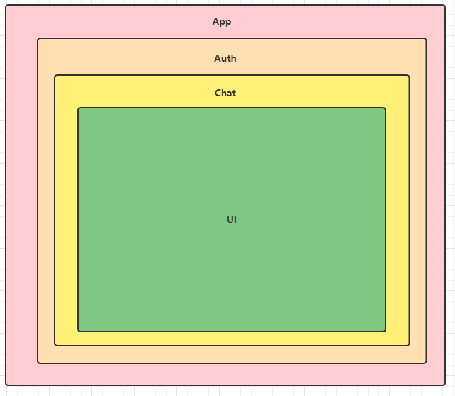
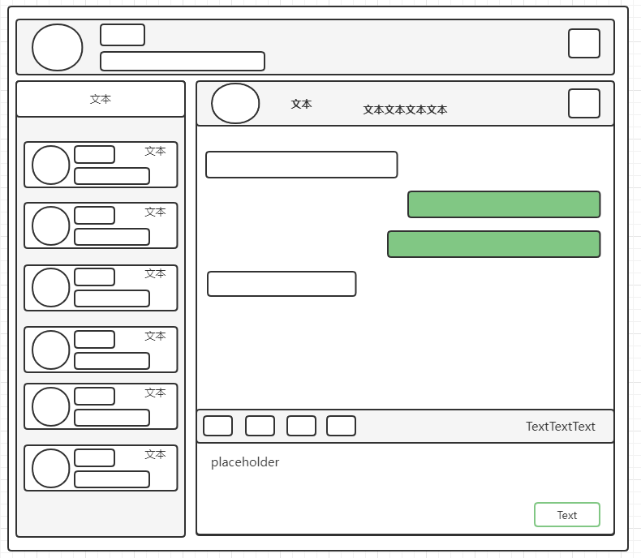
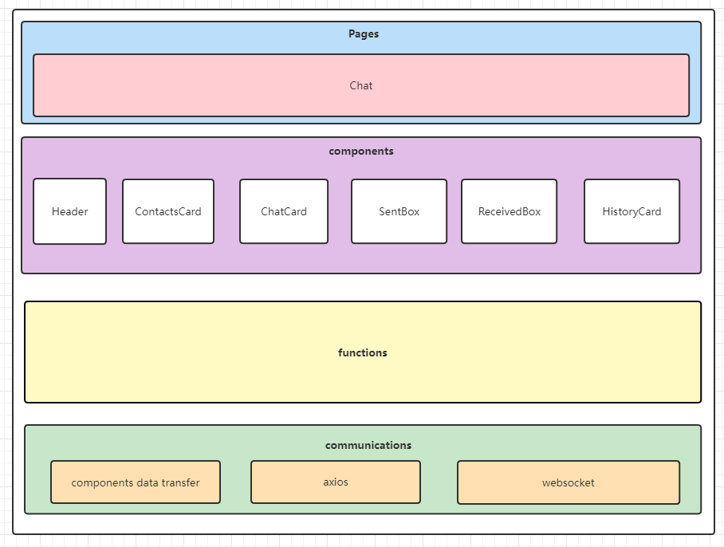

#react-vite-re-chat
> react-vite-chatroom 重构版

##相关技术
vite | react | react-router-dom | WebSocket | events | tailwind CSS

##步骤
1、搭建基本框架
2、页面编写，组件封装

##前言
<br /> 1、在用户未授权/未登录成功之前不打开 websocket 链接，如何实现？（WebSocket 动态连接）
<br /> 2、页面如何拆分，组件如何封装？
<br /> 3、发送/接收消息时，聊天界面如何更新/渲染？

### WebSocket 连接动态开启
先上一张组件嵌套图



上部分代码，关键就在`<Auth>`和`<Chat>`层
```js
// routes.jsx
<BrowserRouter>
  <Routes>
    <Route path={'/'} element={<App />} />
    <Route path={'/login'} element={<Login />} />
  </Routes>
</BrowserRouter>
```

```js
// App.jsx
<Auth>
  <Chat />
</Auth>
```

```js
// Auth.jsx
import { useEffect } from "react";
import { useSelector } from "react-redux";
import { useNavigate } from "react-router-dom";

export default function Auth(props) {

  // 从 redux 中获取登录状态
  const isAuth = useSelector(state => state.isAuth)
  const navigate = useNavigate();

  useEffect(() => {
    authCheck()
  }, [])

  const authCheck = () => {
    // 未登录，跳转到登录页
    if (!isAuth) {
      navigate('/login')
    }
    
    // 已登录状态才会加载子组件
  }
  return ( <div> { isAuth ? props.children : <></> } </div> )
}
```

```js
// Chat.jsx
import {useEffect} from "react";
export default function Chat() {
  console.log('auth success, load Chat page')

  useEffect(() => {
    openWebsocket().then(res => {
      console.log('opening websocket')
    }).catch(err => {
      console.log('open websocket error: ', err.message)
    })
  }, [])

  const openWebsocket = () => import('@/network/websocket/websocket')
  return ( <div></div> )
}
```

####组件封装
先将界面大概描绘出来



可将界面大概分为以下组件：聊天框头部、通讯好友、聊天框、发送消息框、接收消息框




##参考
[基于 Vue 开发一个 多人聊天室（万字长文） - 从 0 到 1 篇](https://segmentfault.com/a/1190000040688086)


